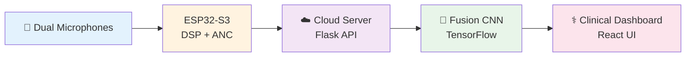

<div align="center">

# 🩺 AI-Powered Digital Stethoscope
### *Cloud-Connected Heart Murmur Detection System*

[](https://www.espressif.com/)
[](https://www.tensorflow.org/)
[](https://www.python.org/)
[](https://reactjs.org/)
[](LICENSE)


*An open-source IoT medical device combining embedded systems, digital signal processing, and cloud-based AI inference for automated cardiac diagnostics.*

[📖 Documentation](#-documentation) •
[🚀 Quick Start](#-quick-start) •
[🎯 Features](#-features) •
[🔧 Hardware](#-hardware-setup) •
[💻 Software](#-cloud-backend-setup)

</div>

---

## 🌟 Overview

This project presents a complete IoT healthcare solution integrating:
- **Custom Hardware**: Dual-microphone digital stethoscope with active noise cancellation
- **Embedded Firmware**: ESP32-S3 real-time audio processing and wireless transmission
- **Cloud AI**: TensorFlow-based deep learning model achieving **91% accuracy** in heart murmur detection
- **Web Interface**: React-based dashboard for clinicians with dual-mode analysis

<div align="center">



</div>

---

## 🎯 Key Features

<table>
<tr>
<td width="33%" align="center">


### 🔇 Active Noise Cancellation
**+12.6 dB SNR Improvement**

LMS adaptive filtering with dual-microphone setup for robust performance in noisy clinical environments
</td>
<td width="33%" align="center">


### 🧠 Cloud AI Inference
**91% Diagnostic Accuracy**

Fusion CNN processing Mel-spectrograms, MFCCs, and HRV features for heart murmur classification
</td>
<td width="33%" align="center">


### 📡 Wireless Connectivity
**Wi-Fi + USB Modes**

Real-time streaming to cloud, local SD storage, and direct PC transfer via USB Mass Storage
</td>
</tr>
</table>

---

## 🏗️ System Architecture

<div align="center">

```
┌─────────────────────────────────────────────────────────────────────┐
│                         HARDWARE LAYER                              │
├─────────────────────────────────────────────────────────────────────┤
│  • CMA-4544PF-W Electret Microphones (Primary + Reference)         │
│  • MAX9814 AGC Pre-Amplifier (40/50/60 dB Gain)                    │
│  • ESP32-S3 (Xtensa LX7 @ 240MHz, 512KB SRAM, 8MB PSRAM)          │
│  • PCM5102A I2S DAC                                                 │
│  • 2500mAh LiPo Battery (9.9hr runtime)                            │
│  • 0.96" OLED Display (128x64, I2C)                                │
└─────────────────────────────────────────────────────────────────────┘
                              ↓
┌─────────────────────────────────────────────────────────────────────┐
│                    SIGNAL PROCESSING LAYER                          │
├─────────────────────────────────────────────────────────────────────┤
│  • 4th-Order Butterworth Bandpass (20-700 Hz)                      │
│  • LMS Active Noise Cancellation (32 taps, μ=0.005)               │
│  • Dual-Channel ADC Sampling (8kHz recording / 16kHz streaming)    │
│  • I2S Audio Output & SD Card Storage (WAV format)                 │
└─────────────────────────────────────────────────────────────────────┘
                              ↓
┌─────────────────────────────────────────────────────────────────────┐
│                      CONNECTIVITY LAYER                             │
├─────────────────────────────────────────────────────────────────────┤
│  • Wi-Fi 802.11 b/g/n (Access Point + Station Mode)               │
│  • MQTT/HTTP Protocols for Cloud Transmission                      │
│  • USB Mass Storage Class (MSC) for Direct PC Access              │
│  • Web Server for Wireless File Download                           │
└─────────────────────────────────────────────────────────────────────┘
                              ↓
┌─────────────────────────────────────────────────────────────────────┐
│                       CLOUD AI LAYER                                │
├─────────────────────────────────────────────────────────────────────┤
│  • Django REST API (Python 3.12, Gunicorn WSGI)                    │
│  • TensorFlow Fusion CNN (1.9M parameters, FP32)                   │
│  • Feature Extraction: Mel-Spectrogram + MFCC + HRV               │
│  • AWS EC2 Deployment (Ubuntu 22.04, Nginx Reverse Proxy)         │
└─────────────────────────────────────────────────────────────────────┘
                              ↓
┌─────────────────────────────────────────────────────────────────────┐
│                    USER INTERFACE LAYER                             │
├─────────────────────────────────────────────────────────────────────┤
│  • React 18 Web Dashboard                                           │
│  • Dual-Mode Analysis (Single-Channel / 4-Valve Advanced)         │
│  • Real-Time Waveform Visualization                                │
│  • Phonocardiogram Generation (Dark/Light Themes)                  │
│  • Patient History Management (localStorage)                       │
└─────────────────────────────────────────────────────────────────────┘
```

</div>

---

## 📁 Repository Structure

```
ai-stethoscope/
│
├── 📂 hardware/
│   ├── pcb/                          # Altium PCB design files
│   ├── schematics/                   # Circuit diagrams
│   ├── gerbers/                      # Manufacturing files
│   └── bom.csv                       # Bill of Materials
│
├── 📂 firmware/
│   ├── esp32_stethoscope/
│   │   ├── esp32_stethoscope.ino    # Main Arduino sketch
│   │   ├── config.h                  # Configuration constants
│   │   ├── lms_anc.cpp              # Active Noise Cancellation
│   │   ├── filters.cpp               # Digital signal processing
│   │   ├── wifi_manager.cpp          # Wi-Fi & web server
│   │   └── usb_msc.cpp              # USB Mass Storage
│   └── libraries/                    # Required Arduino libraries
│
├── 📂 ml_model/
│   ├── train/
│   │   ├── train_model.py           # Model training script
│   │   ├── dataset_loader.py        # CirCor dataset handler
│   │   └── requirements.txt         # Python dependencies
│   ├── final_murmur_model.keras     # 🧠 Trained model (91% acc)
│   ├── model_metadata.pkl           # Label encoder & config
│   └── inference.py                 # Prediction script
│
├── 📂 backend/
│   ├── app.py                        # Flask/Django REST API
│   ├── murmur_inference.py          # ML inference engine
│   ├── requirements.txt             # Backend dependencies
│   └── deployment/
│       ├── gunicorn_config.py       # Production WSGI config
│       ├── nginx.conf               # Reverse proxy config
│       └── systemd/                 # Auto-start service files
│
├── 📂 frontend/
│   ├── src/
│   │   ├── components/              # React components
│   │   ├── App.js                   # Main application
│   │   └── api/                     # Backend API client
│   ├── public/
│   │   └── index.html               # Entry point
│   └── package.json                 # Node dependencies
│
├── 📂 docs/
│   ├── hardware_assembly.md         # PCB assembly guide
│   ├── firmware_upload.md           # ESP32 programming
│   ├── cloud_deployment.md          # AWS setup instructions
│   └── clinical_usage.md            # User manual
│
├── 📂 examples/
│   ├── test_recordings/             # Sample WAV files
│   └── analysis_results/            # Example outputs
│
├── .gitignore
├── LICENSE
└── README.md                         # You are here!
```

---

## 🚀 Quick Start

### Prerequisites

<table>
<tr>
<td width="50%">

**Hardware Requirements**
- ✅ ESP32-S3 Development Board
- ✅ 2× Electret Microphones
- ✅ MAX9814 Amplifier Module
- ✅ PCM5102A DAC (optional)
- ✅ 0.96" OLED Display
- ✅ microSD Card (8GB+)
- ✅ LiPo Battery (2500mAh)

</td>
<td width="50%">

**Software Requirements**
- ✅ Arduino IDE 2.0+
- ✅ Python 3.10+
- ✅ Node.js 18+
- ✅ TensorFlow 2.13+
- ✅ AWS Account (for cloud deployment)

</td>
</tr>
</table>

---

### 🔧 Hardware Setup

#### 1️⃣ **PCB Assembly** *(Or breadboard prototyping)*

```bash
# Download Gerber files for PCB fabrication
cd hardware/gerbers/
# Send to JLCPCB / PCBWay / OSH Park

# For breadboard testing, see:
docs/hardware_assembly.md
```

#### 2️⃣ **Component Connections**

<div align="center">

| Component | ESP32-S3 Pin | Notes |
|-----------|--------------|-------|
| Primary Mic (Analog) | GPIO 1 (ADC1_CH0) | Heart sound + ambient noise |
| Reference Mic (Analog) | GPIO 7 (ADC1_CH6) | Ambient noise only |
| I2S DAC (BCK) | GPIO 4 | Audio output |
| I2S DAC (WS) | GPIO 6 | Word select |
| I2S DAC (DOUT) | GPIO 5 | Data out |
| OLED Display (SDA) | GPIO 8 | I2C data |
| OLED Display (SCL) | GPIO 9 | I2C clock |
| SD Card (CS) | GPIO 35 | Chip select |
| Button 1 (NAV) | GPIO 3 | Navigation |
| Button 2 (SEL) | GPIO 2 | Select/Confirm |

</div>

---

### 💻 Firmware Upload

#### **Step 1: Install Arduino IDE & Libraries**

```bash
# Install ESP32 Board Support
# In Arduino IDE: Tools > Board > Boards Manager
# Search "esp32" → Install "esp32 by Espressif"

# Install Required Libraries
# Tools > Manage Libraries → Install:
# - Adafruit GFX
# - Adafruit ST7735
# - ESP32 SD
```

#### **Step 2: Configure & Upload**

```cpp
// Edit firmware/esp32_stethoscope/config.h
#define WIFI_SSID "YourWiFiName"
#define WIFI_PASSWORD "YourPassword"
#define SERVER_URL "http://your-server-ip:5000"
```

```bash
# Open firmware/esp32_stethoscope/esp32_stethoscope.ino
# Select Board: ESP32S3 Dev Module
# Upload Speed: 921600
# USB CDC: Enabled
# Upload!
```

---

### ☁️ Cloud Backend Setup

#### **Option A: Quick Deploy (5 minutes)**

```bash
cd backend/

# Install dependencies
pip install -r requirements.txt

# Start development server
python app.py
# Server running at http://localhost:5000
```

#### **Option B: Production AWS EC2 Deployment**

```bash
# 1. Launch Ubuntu 22.04 EC2 instance (t2.medium recommended)
# 2. SSH into instance
ssh -i your-key.pem ubuntu@your-ec2-ip

# 3. Clone repository
git clone https://github.com/yourusername/ai-stethoscope.git
cd ai-stethoscope/backend

# 4. Install system dependencies
sudo apt update && sudo apt install -y python3-pip nginx

# 5. Install Python packages
pip3 install -r requirements.txt --break-system-packages

# 6. Configure Gunicorn service
sudo cp deployment/systemd/stethoscope.service /etc/systemd/system/
sudo systemctl enable stethoscope
sudo systemctl start stethoscope

# 7. Configure Nginx reverse proxy
sudo cp deployment/nginx.conf /etc/nginx/sites-available/stethoscope
sudo ln -s /etc/nginx/sites-available/stethoscope /etc/nginx/sites-enabled/
sudo systemctl restart nginx

# ✅ Backend now running at http://your-ec2-ip
```

**📖 Detailed Guide:** See `docs/cloud_deployment.md`

---

### 🌐 Frontend Deployment

```bash
cd frontend/

# Install dependencies
npm install

# Configure API endpoint
# Edit src/api/config.js
export const API_URL = "http://your-server-ip:5000";

# Build for production
npm run build

# Deploy to Vercel (recommended) or any static host
npx vercel --prod
```

---

## 🎮 Usage

### **Device Operation**

<div align="center">

```
Power On → Main Menu → Select Mode
                │
                ├─→ [Start Recording]
                │   ├─ Place on chest
                │   ├─ 12-second recording
                │   ├─ ANC processing
                │   ├─ Upload to cloud
                │   └─ View result
                │
                ├─→ [Saved Files]
                │   └─ Browse recordings
                │
                ├─→ [WiFi Server]
                │   └─ Download via browser
                │
                └─→ [USB Mode]
                    └─ Connect to PC
```

</div>

### **Web Dashboard**

1. **Normal Mode** - Single chest location analysis
2. **Advanced Mode** - 4-valve comprehensive assessment (Aortic, Pulmonary, Tricuspid, Mitral)
3. View **phonocardiogram**, **spectrogram**, **confidence scores**
4. Generate **clinical report** with automated notes
5. Access **patient history** from localStorage

---

## 📊 Performance Metrics

<div align="center">

| Metric | Value | Details |
|--------|-------|---------|
| 🎯 **Diagnostic Accuracy** | **91.0%** | CirCor test set (N=957) |
| 🔍 **Precision** | **95.6%** | Positive Predictive Value |
| ❤️ **Recall (Sensitivity)** | **86.0%** | Catches 86% of murmurs |
| ⚖️ **F1-Score** | **0.906** | Harmonic mean |
| 📈 **AUC-ROC** | **0.97** | Excellent discrimination |
| 🔇 **SNR Improvement** | **+12.6 dB** | LMS ANC performance |
| ⚡ **Inference Latency** | **145 ms** | End-to-end (cloud) |
| 🔋 **Battery Life** | **9.9 hours** | Mixed-use testing |

</div>

### **Confusion Matrix**

```
                Predicted
              Absent  Present
Actual  
Absent      460      19      (96.0% specificity)
Present      67     411      (86.0% sensitivity)
```

---

## 🧠 ML Model Architecture

<div align="center">

```
┌─────────────────────────────────────────────┐
│         INPUT LAYER (Multi-Modal)           │
├─────────────────────────────────────────────┤
│  • Mel-Spectrogram (128×128)               │
│  • MFCC Features (40×128)                  │
│  • HRV Metrics (mean RR, std, RMSSD)      │
└─────────────────────────────────────────────┘
                    ↓
        ┌───────────┴───────────┐
        ↓                       ↓
┌──────────────┐        ┌──────────────┐
│ CNN Branch 1 │        │ CNN Branch 2 │
│              │        │              │
│ Conv2D (32)  │        │ Conv2D (32)  │
│ MaxPool      │        │ MaxPool      │
│ Conv2D (64)  │        │ Conv2D (64)  │
│ MaxPool      │        │ MaxPool      │
│ Conv2D (128) │        │              │
│ GlobalAvgPool│        │ GlobalAvgPool│
└──────────────┘        └──────────────┘
        │                       │
        └───────────┬───────────┘
                    ↓
            ┌──────────────┐
            │  Dense (16)  │ ← HRV Input
            │  Dropout 0.4 │
            └──────────────┘
                    ↓
            ┌──────────────┐
            │ Concatenate  │
            └──────────────┘
                    ↓
            ┌──────────────┐
            │ Dense (128)  │
            │ Dropout 0.6  │ ← L2 Regularization (0.02)
            │ Dense (64)   │
            │ Dropout 0.6  │
            └──────────────┘
                    ↓
        ┌──────────────────────┐
        │  Output (Softmax 2)  │
        │  [Normal | Murmur]   │
        └──────────────────────┘
```

**Parameters:** 1.9M trainable  
**Training:** 50 epochs, Adam optimizer, ReduceLROnPlateau  
**Dataset:** CirCor DigiScope Phonocardiogram (5,272 recordings)

</div>

---

## 🛠️ Hardware Specifications

### **Bill of Materials (BOM)**

| Component | Model | Quantity | Unit Price | Total |
|-----------|-------|----------|------------|-------|
| Microcontroller | ESP32-S3-DevKitC | 1 | 1,100 BDT | 1,100 BDT |
| Microphones | CMA-4544PF-W | 2 | 380 BDT | 760 BDT |
| Pre-Amplifier | MAX9814 AGC | 1 | 350 BDT | 350 BDT |
| DAC | PCM5102A I2S | 1 | 250 BDT | 250 BDT |
| Display | SSD1306 OLED 0.96" | 1 | 350 BDT | 350 BDT |
| Battery | LiPo 2500mAh 3.7V | 1 | 850 BDT | 850 BDT |
| Charger | TP4056 Module | 1 | 80 BDT | 80 BDT |
| microSD Card | 8GB Class 10 | 1 | 400 BDT | 400 BDT |
| PCB | Custom 2-Layer | 1 | 500 BDT | 500 BDT |
| Enclosure | ABS Injection-Molded | 1 | 800 BDT | 800 BDT |
| Misc | Resistors, Caps, Wires | - | 1,000 BDT | 1,000 BDT |
| **TOTAL** | | | | **7,850 BDT** |

*~ $66 USD at current exchange rates*

---

## 📖 Documentation

| Document | Description |
|----------|-------------|
| 📘 [Hardware Assembly Guide](docs/hardware_assembly.md) | PCB soldering & component placement |
| 🔌 [Firmware Upload Guide](docs/firmware_upload.md) | ESP32 programming & configuration |
| ☁️ [Cloud Deployment Guide](docs/cloud_deployment.md) | AWS EC2 setup & production deployment |
| 👨‍⚕️ [Clinical Usage Manual](docs/clinical_usage.md) | Operating instructions for healthcare workers |
| 🔧 [Troubleshooting Guide](docs/troubleshooting.md) | Common issues & solutions |
| 📊 [API Documentation](docs/api_docs.md) | Backend REST API reference |

---

## 🎓 Technical Papers & References

### **Published Work**
- [Final Year Design Project Report](docs/FYDP_Report.pdf) - Complete technical documentation
- [ATC Presentation Slides](docs/ATC_Presentation.pdf) - Project defense presentation

### **Key References**
1. **CirCor DigiScope Dataset** - Training data source  
   *Oliveira et al., 2022, PhysioNet*
   
2. **Active Noise Cancellation Algorithm**  
   *LMS Adaptive Filtering - Widrow & Hoff, 1960*
   
3. **Heart Sound Classification**  
   *Deep Learning for Phonocardiogram Segmentation - Springer et al., 2016*

---

## 🤝 Contributing

We welcome contributions! Here's how you can help:

<div align="center">

| Area | Ways to Contribute |
|------|-------------------|
| 🔧 **Hardware** | PCB design improvements, enclosure optimization |
| 💻 **Firmware** | Battery optimization, new features |
| 🧠 **ML Model** | Larger datasets, model architecture experiments |
| 🌐 **Frontend** | UI/UX improvements, new visualizations |
| 📖 **Documentation** | Tutorials, translations, video guides |

</div>

### **Contribution Workflow**

```bash
# 1. Fork the repository
# 2. Create feature branch
git checkout -b feature/amazing-feature

# 3. Make changes & commit
git commit -m "Add amazing feature"

# 4. Push to branch
git push origin feature/amazing-feature

# 5. Open Pull Request
```

**📋 Guidelines:** See [CONTRIBUTING.md](CONTRIBUTING.md)

---

## 🐛 Known Issues & Roadmap

### **Current Limitations**
- ⚠️ **14% False Negative Rate** - Some faint murmurs missed (Grade 1/6)
- ⚠️ **Wi-Fi Dependency** - Real-time analysis requires connectivity (offline mode records only)
- ⚠️ **Adult-Only Validation** - Pediatric testing in progress

### **Future Enhancements**
- [ ] 🎯 **Signal Quality Guardrail** - Real-time feedback on microphone placement
- [ ] 📱 **Mobile App** - Native Android/iOS application
- [ ] 🔋 **Edge AI Fallback** - On-device inference when offline (78% accuracy)
- [ ] 🌍 **Multi-Language Support** - Bengali, Hindi interface options
- [ ] 📊 **Clinical Trial** - Multi-center validation study (N=500)
- [ ] 🔐 **HIPAA Compliance** - Full healthcare data privacy certification

---

## 📜 License

This project is licensed under the **MIT License** - see the [LICENSE](LICENSE) file for details.

**✅ Open Source**: Use, modify, and distribute freely!

---

## 🙏 Acknowledgments

<div align="center">

### **Special Thanks To**

| Contributor | Role |
|-------------|------|
| 🏫 **BRAC University EEE Department** | Research support & lab facilities |
| 👨‍⚕️ **Dr. Nazmul Haque, MD** | Clinical validation & medical guidance |
| 🎓 **ATC Panel Members** | Technical review & mentorship |
| 📊 **PhysioNet CirCor Team** | Open-source dataset provision |
| 💻 **Espressif Systems** | ESP32 documentation & support |
| 🌐 **Open-Source Community** | Libraries, tools, and inspiration |

</div>

---

## 📞 Contact & Support

<div align="center">

### **Project Maintainer**

**Your Name**  
📧 Email: your.email@example.com  
🔗 LinkedIn: [linkedin.com/in/yourprofile](https://linkedin.com)  
🐙 GitHub: [@yourusername](https://github.com/yourusername)

---

### **Get Help**

[](https://github.com/yourusername/ai-stethoscope/issues)
[](https://github.com/yourusername/ai-stethoscope/discussions)
[](mailto:your.email@example.com)

</div>

---

## ⭐ Star History

<div align="center">

[](https://star-history.com/#yourusername/ai-stethoscope&Date)

**If this project helped you, please consider giving it a ⭐ star!**

</div>

---

<div align="center">

### 🩺 *Made with ❤️ for Healthcare Accessibility*

**[⬆ Back to Top](#-ai-powered-digital-stethoscope)**

---

© 2026 AI Stethoscope Team • Built with ESP32, TensorFlow & React

</div>
